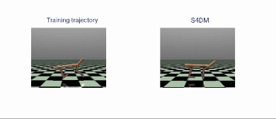

### Sequential Decision Modelling using Structured State Spaces

    
    

## Overview

This project explores the application of sequence models to the problem of credit assignment in Reinforcement Learning (RL). Specifically, it involves implementing a novel architecture, the Structured State Space Sequence Model (S4), within the framework of Decision Transformers. The aim is to improve the agent's ability to determine the true source of returns from a trajectory of states and actions, especially in environments with long episodes and sparse rewards.

### Key Objectives

1. **S4 Implementation**: Replace the transformer-based sequence model in the Decision Transformer framework with the S4 architecture to handle longer trajectories more effectively.
2. **Performance Benchmarking**: Compare the performance of the S4 Decision Model (S4DM) against the baseline Decision Transformer and Behavioral Cloning models across various RL environments.
3. **Hyperparameter Tuning**: Conduct a grid search to identify optimal hyperparameters for the S4 model to maximize performance.

### Methodology

- **Data Collection**: The project uses datasets from the OpenAI MuJoCo platform, including environments such as Half-Cheetah, Walker2D, and Hopper. These datasets contain trajectories generated by sub-optimal agents.
- **Sequence Modelling**: The S4 architecture, which leverages the HiPPO kernel for efficient sequence modelling, is integrated into the Decision Transformer framework.
- **Experimental Setup**: Experiments are conducted on three MuJoCo environments with datasets of "medium" and "medium-replay" trajectories. Each experiment is run multiple times with different seeds to ensure accuracy and reliability of results.

### Structured State Space Sequence Model (S4)

The S4 model is designed to address the problem of Long-Range Dependencies (LRDs) in sequential data, which are challenging for traditional models such as RNNs, CNNs, and Transformers due to issues like vanishing gradients.

The state space model is defined by the equations:
$$ x'(t) = Ax(t) + Bu(t) $$
$$ y(t) = Cx(t) + Du(t) $$

where $ x(t) $ is the state vector, $ u(t) $ is the input, and $ y(t) $ is the output. The matrices $ A $, $ B $, $ C $, and $ D $ define the dynamics of the state space model.

To address computational challenges, the S4 model modifies the state matrix $ A $ using the HiPPO kernel:
$$ A = \text{HiPPO}(A) $$

The HiPPO kernel provides a way to efficiently model long sequences by compressing historical data into a manageable representation.

### HiPPO Framework

The HiPPO framework deals with the problem of memory in LRD as an online function approximation issue. It aims to maintain a compressed representation of the history of a function $ f $. The projection of $ f $ onto a polynomial space with respect to a measure $ \mu(t) $ results in coefficients $ c(t) $, which are updated recursively:
$$ c'(t) = A c(t) + B u(t) $$

By discretizing the dynamics, we can compute these coefficients efficiently, providing a compact form of the sequence's history.

<!-- ### S4 Layer

Each S4 layer consists of a HiPPO kernel and a feed-forward network with nonlinear activations and a linear transformation. The layer maps sequences to sequences with a structure similar to RNNs and Transformers:
$$ \text{S4}(x_t) = \text{FFN}(\text{HiPPO}(x_t)) $$ -->

### Implementation in Decision Transformer

The Decision Transformer (DT) framework uses a transformer to predict future actions based on past states, actions, and a desired return-to-go. The S4DM model replaces the transformer with the S4 architecture. The trajectory is represented as:
$$ \tau = [R_t, s_t, a_t, R_{t+1}, s_{t+1}, a_{t+1}, \ldots, R_T, s_T, a_T] $$

### Training Procedure

1. **Initialization**: Initialize the state $ s $, action $ a $, and reward $ R $.
2. **Sequence Modelling**: Use the S4 layers to process the trajectory and predict the next action:
$$ a_{t+1} = \text{S4DM}([R_t, s_t, a_t, R_{t+1}, s_{t+1}, a_{t+1}, \ldots, R_T, s_T, a_T]) $$
3. **Optimization**: Minimize the mean squared error between predicted and actual actions:
$$ \mathcal{L} = \frac{1}{T} \sum_{t=1}^T (a_t - \hat{a}_t)^2 $$

### Hyperparameter Tuning

A grid search was conducted to find the optimal hyperparameters, including the learning rate, kernel state space dimension, and number of S4 layers. The best performance was achieved with:
- Learning rate: $ 6.1 \times 10^{-4} $
- Kernel state space dimension: 256
- Number of S4 layers: 16

### Results and Findings

The S4DM model outperformed the baseline Decision Transformer and Behavioral Cloning models in terms of maximum reward obtained. The performance was sensitive to hyperparameter settings, with the best results achieved using the specified parameters.

### Conclusion

The project demonstrates that the S4 architecture can effectively enhance the performance of Decision Transformers in RL tasks, particularly in environments with long trajectories. The increased "memory" provided by the HiPPO kernel enables better credit assignment, leading to improved performance.

### Repository and Resources

To read the full analysis, you can download the [PDF file](https://vitoriarlima.github.io/files/S4_decision_transformer.pdf).

Slides deck presentation of the results [here](https://docs.google.com/presentation/d/1zFm0WUj-mHd8MR1ytRNR7XZ_lBN9gw8SU58nzEDB0L8/edit?usp=sharing).

<!-- 
### Sequential Decision Modelling using Structured State Spaces

    
    

## Overview

This project explores the application of sequence models to the problem of credit assignment in Reinforcement Learning (RL). Specifically, it involves implementing a novel architecture, the Structured State Space Sequence Model (S4), within the framework of Decision Transformers. The aim is to improve the agent's ability to determine the true source of returns from a trajectory of states and actions, especially in environments with long episodes and sparse rewards.

### Key Objectives

1. **S4 Implementation**: Replace the transformer-based sequence model in the Decision Transformer framework with the S4 architecture to handle longer trajectories more effectively.
2. **Performance Benchmarking**: Compare the performance of the S4 Decision Model (S4DM) against the baseline Decision Transformer and Behavioral Cloning models across various RL environments.
3. **Hyperparameter Tuning**: Conduct a grid search to identify optimal hyperparameters for the S4 model to maximize performance.

### Methodology

- **Data Collection**: The project uses datasets from the OpenAI MuJoCo platform, including environments such as Half-Cheetah, Walker2D, and Hopper. These datasets contain trajectories generated by sub-optimal agents.
- **Sequence Modelling**: The S4 architecture, which leverages the HiPPO kernel for efficient sequence modelling, is integrated into the Decision Transformer framework.
- **Experimental Setup**: Experiments are conducted on three MuJoCo environments with datasets of "medium" and "medium-replay" trajectories. Each experiment is run multiple times with different seeds to ensure accuracy and reliability of results.

### Findings

- **Performance Improvement**: The S4DM model consistently outperformed the baseline Decision Transformer and Behavioral Cloning models across all environments and datasets in terms of maximum reward obtained.
- **Hyperparameter Sensitivity**: The performance of the S4DM model was sensitive to hyperparameter settings, with the best results achieved using a learning rate of 6.1e-4, a kernel size of 256 dimensions, and 16 S4 layers.

### Conclusion

The project demonstrates that the S4 architecture can effectively enhance the performance of Decision Transformers in RL tasks, particularly in environments with long trajectories. The results suggest that the increased "memory" of the S4 model, enabled by the HiPPO kernel, provides a distinct advantage in assigning credit to critical actions in a trajectory.

### Future Work

Future research will focus on testing the S4DM model in a wider range of environments, particularly those with very long trajectories, and further tuning the hyperparameters to fully realize the potential of the S4 architecture.

### Repository and Resources

To read the full analysis, you can download the [PDF file](https://vitoriarlima.github.io/files/S4_decision_transformer.pdf).

Slides deck presentation of the results [here](https://docs.google.com/presentation/d/1zFm0WUj-mHd8MR1ytRNR7XZ_lBN9gw8SU58nzEDB0L8/edit?usp=sharing).

---
<!-- 
### Pretty Visualizations

<!--  -->

<!--  --> 

<!-- ### Pretty Visualizations

    
    

 --> 
